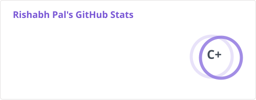

  

<h1 align="center">Hey, I'm Rishabh.</h1>

<i>Computer Science at RKGIT, Ghaziabad · Backend &amp; systems programming</i>

  I build backend systems, write C++, and spend a little too long on edge cases.

  <a href="https://risbh19.xyz">Portfolio</a> ·
  <a href="https://www.linkedin.com/in/rishabhpal19/">LinkedIn</a> ·
  <a href="mailto:palrishabh989@gmail.com">Email</a>

  
  &nbsp;&nbsp;&nbsp;
  
  &nbsp;&nbsp;&nbsp;
  

---

### About me

I'm a Computer Science undergraduate interested in how software works beneath the interface—from network protocols and storage engines to APIs and database transactions.

- **Systems:** building a Redis-compatible server and a desktop editor from the document model up.
- **Backend:** working with authentication, concurrency, data consistency and real-time updates.
- **Problem solving:** practising data structures and algorithms in C++.
- **Looking for:** software engineering internships with hands-on backend and systems work.

### Tools &amp; Skills

  
  &nbsp;
  
  &nbsp;
  
  &nbsp;
  
  &nbsp;
  
  &nbsp;
  
  &nbsp;
  
  &nbsp;
  
  &nbsp;
  
  &nbsp;
  
  &nbsp;
  
  &nbsp;
  
  &nbsp;
  
  &nbsp;
  
  &nbsp;
  
  &nbsp;
  
  &nbsp;
  
  &nbsp;
  

### Selected work

| Project | What I built | Stack |
| --- | --- | --- |
| [mini-redis](https://github.com/risbh19/mini-redis) | A Redis-compatible string store with an `epoll` reactor, RESP2, incremental rehashing, TTL/LRU eviction, snapshots and an append-only log. | C++17 · Linux |
| [Orbit](https://github.com/risbh19/ide) | A desktop IDE with a custom piece-table editor, undo/redo, multi-cursor editing, JavaScript/TypeScript language intelligence and a PTY terminal. | TypeScript · Electron |
| [Paper Trading Engine](https://github.com/risbh19/trading-bot) | A simulator with deterministic replay, partial fills, fees and pre-trade risk checks. Python tools analyse sessions and reconcile the trade ledger. | C++20 · Python |
| [RaceSafe](https://github.com/risbh19/racesafe) | Hackathon team formation with concurrency-safe seat allocation, expiring invites, leader approvals and live updates. | FastAPI · PostgreSQL · React |
| [College Forum](https://github.com/risbh19/college-forum) | A campus discussion platform with Google sign-in, pseudonymous usernames, posts, comments, voting and moderation. [Live app](https://college-forum.vercel.app/) | Next.js · FastAPI · PostgreSQL |

### Experience

**Software Testing Intern · R-Cube Green Technology LLP**  
Remote · 1 month

- Tested AcadShree School ERP APIs and workflows using Postman.
- Validated API responses and ran functional and regression checks.
- Documented defects with reproduction steps.

---

### GitHub stats

<!-- CONTRIBUTION_STATS:START -->
<a href="https://github.com/risbh19">
  <picture>
    <source media="(prefers-color-scheme: dark)" srcset="assets/github-stats-dark.svg" />
    
  </picture>
</a>
<!-- CONTRIBUTION_STATS:END -->

---

After hours: anime, retro aesthetics, and one more episode.

